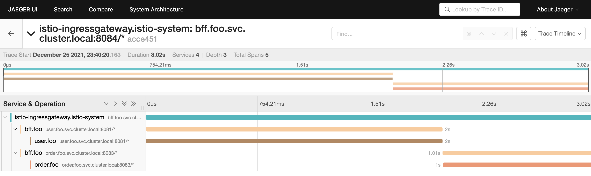

## install istio

```shell
curl -L https://istio.io/downloadIstio | sh -
cd istio-1.12.1
sudo cp bin/istioctl /usr/local/bin
istioctl install --set profile=demo -y
```

## 服务部署

```shell
kubectl create ns foo
kubectl label ns foo istio-injection=enabled
kubectl apply -f yaml/apps/ -n foo
```

## ingress

证书制作

```shell
openssl req -x509 -sha256 \
    -nodes -days 365 -newkey rsa:2048 \
    -subj "/CN=*.example.com/O=example" \
    -keyout example.key -out example.crt

kubectl create -n istio-system \
    secret tls example-tls --key=example.key --cert=example.crt
```

Ingress

```shell
kubectl apply -f ingress.yaml -n foo
```

Test

```shell
kubectl get svc -n istio-system  # ingress ip
curl --resolve www.example.com:443:10.104.120.193 https://www.example.com/headers -k -i
```

输出结果如下

> HTTP/2 200 

accept: */*
user-agent: curl/7.68.0
version: 1.0
x-b3-sampled: 1
x-b3-spanid: e5d6e4b3e6977048
x-b3-traceid: 04e0f6d1fc9c3e56e5d6e4b3e6977048
x-envoy-attempt-count: 1
x-envoy-internal: true
x-forwarded-for: 192.168.3.11
x-forwarded-proto: https
x-request-id: 506659b2-5d77-9e29-9f87-ca43f5d6ed0d
date: Sat, 25 Dec 2021 14:06:18 GMT
content-length: 0
x-envoy-upstream-service-time: 1002
server: istio-envoy

## trace 可观测

install

```shell
kubectl apply -f jaeger.yaml
```

specs

```shell
kubectl apply -f specs.yaml -n foo  # 默认采用svc
```

调整采样

```shell
kubectl edit configmap istio -n istio-system

## set tracing.sampling=100
## from https://istio.io/latest/docs/tasks/observability/distributed-tracing/mesh-and-proxy-config/#customizing-trace-sampling
```

测试

```shell
# 签发一个token
$ curl -XPOST -H "Content-type: application/json" --resolve www.example.com:443:10.104.120.193 https://www.example.com/auth -k -d '{"username": "admin", "password": "admin"}'

# 访问我的订单
$ curl --resolve www.example.com:443:10.104.120.193 https://www.example.com/myorders -k -H "Authorization: Bearer <token>"
```

示例

